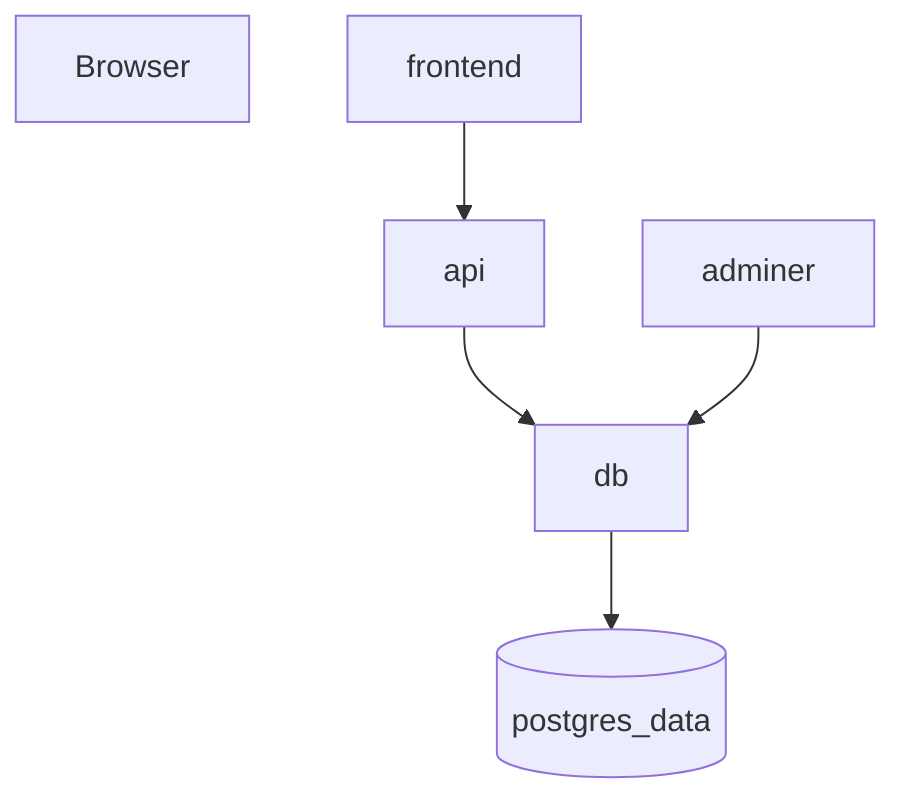

# Integration der Services

## Ziel

In diesem Auftrag integrieren Sie ein Mehrcontainer-System mit Docker Compose.

Sie lernen dabei:

* wie Container innerhalb eines Compose-Projekts miteinander kommunizieren
* warum **Servicenamen statt localhost** verwendet werden
* wie Daten mit **Volumes persistent gespeichert** werden
* typische Probleme bei der Integration zu erkennen und zu beheben

---

## Hinweise

* Arbeiten Sie strukturiert
* Lesen Sie Fehlermeldungen im Terminal genau
* Testen Sie Änderungen schrittweise
* Ziel ist das Verstehen der Zusammenhänge – nicht nur das Ergebnis

---

## Ausgangslage

Das Projekt enthält eine einfache Anwendung mit mehreren Services:

* `api` = Python-API
* `db` = PostgreSQL Datenbank
* `adminer` = Webinterface für die Datenbank
* `frontend` = Weboberfläche

Im Fokus dieser Woche stehen:

* funktionierendes Gesamtsystem zu erstellen.
* API ↔ DB verbinden
* Persistenz umsetzen
* Admin-Tool einbinden
* Frontend als zusätzlichen Service integrieren

Die Dockerfiles sind vollständig und funktionsfähig.  
Eine Compose-Konfiguration ist bereits vorhanden, jedoch **noch nicht vollständig korrekt**.

---

## Abgabe / Nachweis

Am Ende sollte:

* das System mit **einem Befehl startbar** sein
* API, Datenbank, Frontend und Adminer zusammenarbeiten
* Daten nach einem Neustart erhalten bleiben
* folgende Artefakte vorhanden sein:

```
docs/
├── statusbericht-woche2.md
├── architektur.md
└── questions.md (Fragen beantwortet)
```

---

## Arbeitsauftrag

Bearbeiten Sie den Auftrag in Ihrem eigenen Repository:

```bash
cp -rf ticketboard ~/bbzw/bbzw-m347-<klasse>_<nachname>_<vorname>/pw02/02_project/
```

---

### 1. Compose-Datei erstellen

Erstellen Sie eine Datei:

```bash
compose.yaml
```

Definieren Sie darin mindestens folgende Services:

* api
* db
* adminer
* frontend

---

### 2. System starten

Starten Sie das System:

```bash
docker compose up --build
```

---

### 3. Beobachten

Analysieren Sie das Verhalten:

* Welche Services starten?
* Welche nicht?
* Welche Fehlermeldungen erscheinen?
* Was ist im Browser erreichbar?

---

### 4. Konfiguration erarbeiten

Erstellen Sie eine funktionierende Compose-Konfiguration.

Nutzen Sie dazu:

* die vorhandenen Dockerfiles
* die Datei `.env`
* die offizielle Dokumentation der verwendeten Docker-Images

---

#### Vorgehen

Gehen Sie strukturiert vor:

##### a) Ports definieren

Überlegen Sie, welche Services von ausserhalb des Systems erreichbar sein müssen.

Prüfen Sie dazu die Dockerfiles und bestimmen Sie:

* welcher Port im Container verwendet wird
* welcher Port auf dem Host verwendet werden soll

Für den Adminer-Service entnehmen Sie den verwendeten Port aus der offiziellen Dokumentation:

https://hub.docker.com/_/adminer

---

##### b) Datenbank konfigurieren

Die PostgreSQL-Datenbank benötigt beim Start zwingend Konfigurationswerte.

Prüfen Sie die Datei `.env` und übernehmen Sie die benötigten Variablen in Ihre Compose-Konfiguration.

Welche Variablen benötigt werden, finden Sie in der offiziellen Dokumentation:

https://hub.docker.com/_/postgres

---

#### Ziel dieses Schritts

Am Ende dieses Schritts soll:

* das System starten
* die Services laufen
* die API grundsätzlich erreichbar sein
* die Verbindung zur Datenbank konfiguriert sein

---

### 5. Persistenz umsetzen

Stellen Sie sicher, dass die Datenbank-Daten erhalten bleiben.

Dazu müssen Sie:

* ein Volume definieren (Name: `postgres_data`)
* dieses korrekt im Datenbank-Service verwenden

---

#### Hinweise

* Das Volume muss im Datenbank-Service eingebunden werden.
* PostgreSQL speichert seine Daten im Container im Verzeichnis:

`/var/lib/postgresql/data`

Diese Information finden Sie in der offiziellen Dokumentation des PostgreSQL-Docker-Images.

---

### 6. System testen

Überprüfen Sie:

* API erreichbar (`/health`)
* Adminer erreichbar
* Datenbankverbindung funktioniert

Testen Sie zusätzlich:

1. System starten
2. Daten erstellen mit Hilfe von Adminer
3. Container löschen (`docker compose down`)
4. System neu starten

* Sind die Daten noch vorhanden?

---

## Architektur

Erstellen Sie:

```
docs/architektur.md
```

Beschreiben Sie den Aufbau Ihres Systems:

* Frontend
* API
* Datenbank
* Adminer
* Verbindungen zwischen den Services
* Persistenz (Volume)

Sie können optional ein Diagramm mit **Mermaid** erstellen:



## Statusbericht

Erstellen Sie:

```
docs/statusbericht-woche2.md
```

Inhalt:

* umgesetzte Arbeiten
* aktueller Stand
* Probleme
* nächste Schritte

---

### Fragen

Beantworten Sie die Fragen in:

```
docs/questions.md
```

---
